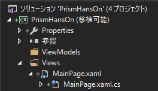

# ViewModelを追加する

## フォルダの整理  

1. Viewsフォルダの追加  
2. ViewModelsフォルダの追加  
3. MainPageをViewsフォルダへ移動  



## MainPageの名前空間をViewsの下へ移動する  

MainPage.xaml  
変更前  
```xml
<?xml version="1.0" encoding="utf-8" ?>
<ContentPage xmlns="http://xamarin.com/schemas/2014/forms"
             xmlns:x="http://schemas.microsoft.com/winfx/2009/xaml"
             xmlns:local="clr-namespace:PrismHansOn"
             x:Class="PrismHansOn.MainPage">
```

変更後  
```xml
<?xml version="1.0" encoding="utf-8" ?>
<ContentPage xmlns="http://xamarin.com/schemas/2014/forms"
             xmlns:x="http://schemas.microsoft.com/winfx/2009/xaml"
             xmlns:local="clr-namespace:PrismHansOn"
             x:Class="PrismHansOn.Views.MainPage">
```

MainPage.xaml.cs  
変更前  
```cs
namespace PrismHansOn
{
	public partial class MainPage : ContentPage
```

変更後  
```cs
namespace PrismHansOn.Views
{
	public partial class MainPage : ContentPage
```

InitializeComponentがないとエラーがでるかもしれませんが  

1. リビルドする  
2. IDEを終了する  
3. 全てのプロジェクトのbin/objフォルダを削除する  
4. IDEを起動する  
5. リビルド  

1.もしくは5.までをすると、だいたい直ります。

## MainPageViewModelの追加  

```cs
using Prism.Mvvm;

namespace PrismHansOn.ViewModels
{
	public class MainPageViewModel : BindableBase
	{
		private string _message = "Hello, Prism for Xamarin.Forms!";

		public string Message
		{
			get => _message;
			set => SetProperty(ref _message, value);
		}
	}
}
```

## ViewModelをViewに適用する  

変更前
```xml
<?xml version="1.0" encoding="utf-8" ?>
<ContentPage xmlns="http://xamarin.com/schemas/2014/forms"
             xmlns:x="http://schemas.microsoft.com/winfx/2009/xaml"
             xmlns:local="clr-namespace:PrismHansOn"
             x:Class="PrismHansOn.Views.MainPage">

	<Label Text="Welcome to Xamarin Forms!" 
           VerticalOptions="Center" 
           HorizontalOptions="Center" />

</ContentPage>
```

変更後  
```xml
<?xml version="1.0" encoding="utf-8" ?>
<ContentPage xmlns="http://xamarin.com/schemas/2014/forms"
             xmlns:x="http://schemas.microsoft.com/winfx/2009/xaml"
             xmlns:mvvm="clr-namespace:Prism.Mvvm;assembly=Prism.Forms"
             mvvm:ViewModelLocator.AutowireViewModel="True"
             x:Class="PrismHansOn.Views.MainPage">

	<Label Text="{Binding Message}" 
           VerticalOptions="Center" 
           HorizontalOptions="Center" />

</ContentPage>
```