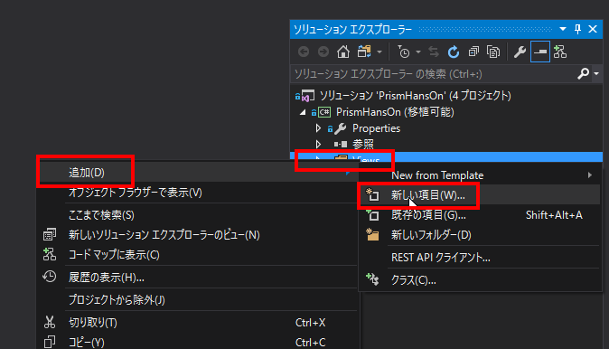
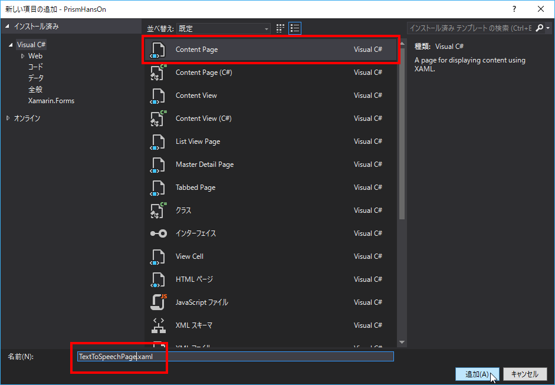

# 基本の画面遷移

## 別画面へ遷移する  

### TextToSpeechPageの追加

Viewsフォルダを右クリックし「追加」＞「新しい項目」を選択する。  



ContentPageを選択し、名前を「SecondPage.xaml」とし追加を押下する。  



### SecondPageをDIコンテナへ登録  

Prismでは画面遷移を遷移名で行います。  
この時、PageのインスタンスはDIコンテナから生成するため、画面遷移させたいPageをDIコンテナへ登録する必要があります。  

それでは、PrismHansOnプロジェクトのApp.xaml.csを開き、RegisterTypesでTextToSpeechPageをDIコンテナへ登録してください。  

```cs
protected override void RegisterTypes()
{
    Container.RegisterTypeForNavigation<MainPage>();
    Container.RegisterTypeForNavigation<SecondPage>();
}
```

### MainPageViewModelへINavigationServiceのインジェクション  

Prismの画面遷移はINavigationServiceを利用して行います。  
このため、MainPageViewModelにつぎのコードを追加し、INavigationServiceを受け取るよう修正しましょう。  

変更前
```cs
public MainPageViewModel(ITextToSpeechService textToSpeechService)
{
    _textToSpeechService = textToSpeechService;
}
```

変更後
```cs
private readonly INavigationService _navigationService;
public MainPageViewModel(INavigationService navigationService, ITextToSpeechService textToSpeechService)
{
    _navigationService = navigationService;
    _textToSpeechService = textToSpeechService;
}
```

INavigationServiceをインジェクションする場合、引数名はnavigationServiceである必要があります。  
順序性に縛りはありませんが、汎用的なINavigationServiceを今回は先に宣言しました。  

### MainPageViewModelへ画面遷移コマンドの追加

MainPageViewModelのSpeakCommandにつぎのコードを追加しましょう。  
INavigationServiceを利用して、SecondPageという名称の画面へ遷移させます。  

```cs
public DelegateCommand NavigateToSecondPageCommand => new DelegateCommand(() =>
{
    _navigationService.NavigateAsync("SecondPage");
});
```

### MainPage.xamlへ画面遷移ボタンの追加  

Speakボタンの後につぎのボタンを追加し、Button押下時にCommandを実行する。  
```xml
<Button Text="Navigate" Command="{Binding NavigateToSecondPageCommand}"/>
```
