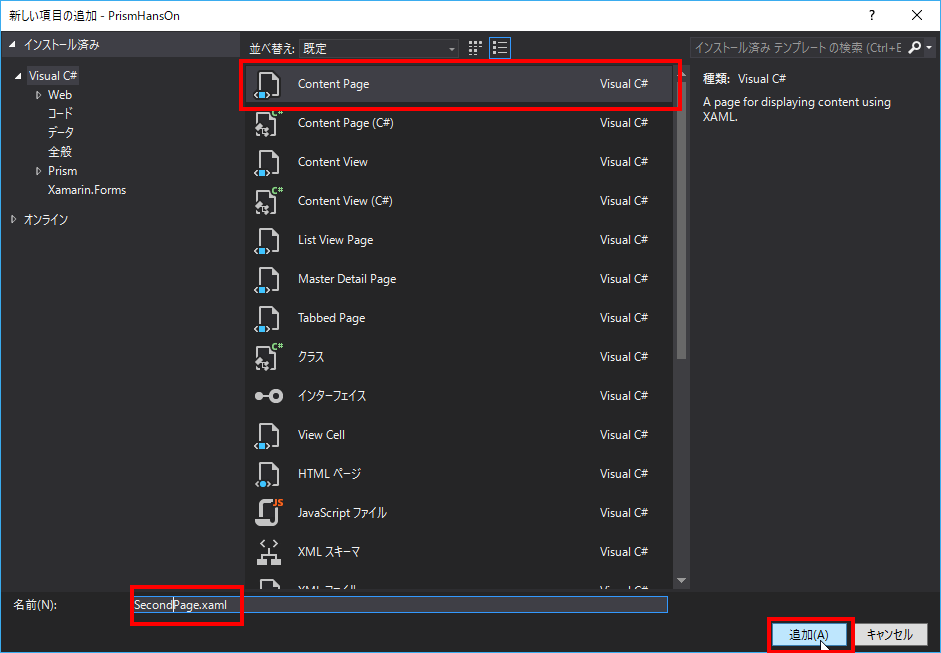

# 基本の画面遷移

## 別画面へ遷移する  

### TextToSpeechPageの追加

Viewsフォルダを右クリックし「追加」＞「新しい項目」を選択する。


ContentPageを選択し、名前を「TextToSpeechPage.xaml」とし追加を押下する。



### TextToSpeechPageをDIコンテナへ登録  

PrismHansOnプロジェクトのApp.xaml.csを開き、RegisterTypesでTextToSpeechPageをDIコンテナへ登録する。  

```cs
protected override void RegisterTypes()
{
    Container.RegisterTypeForNavigation<MainPage>();
    Container.RegisterTypeForNavigation<TextToSpeechPage>();
}
```

### MainPageViewModelへINavigationServiceのインジェクション  

MainPageViewModelにつぎのコードを追加する。  

```cs
private readonly INavigationService _navigationService;
```

コンストラクタを修正します。  

変更前
```cs
public MainPageViewModel()
{
}
```

変更後
```cs
public MainPageViewModel(INavigationService navigationService)
{
    _navigationService = navigationService;
}
```

INavigationServiceをインジェクションする場合、引数名はnavigationServiceである必要があります。

### MainPageViewModelへ画面遷移コマンドの追加

MainPageViewModelにつぎのコードを追加する。  

```cs
public DelegateCommand NavigateToTextToSpeechPageCommand => new DelegateCommand(() =>
{
    _navigationService.NavigateAsync("TextToSpeechPage");
});
```

### MainPage.xamlへ画面遷移ボタンの追加  

Switchの後につぎのボタンを追加し、Button押下時にCommandを実行する。  
```xml
<Button 
    Text="Navigate to TextToSpeechPage" 
    Command="{Binding NavigateToTextToSpeechPageCommand}"/>
```
